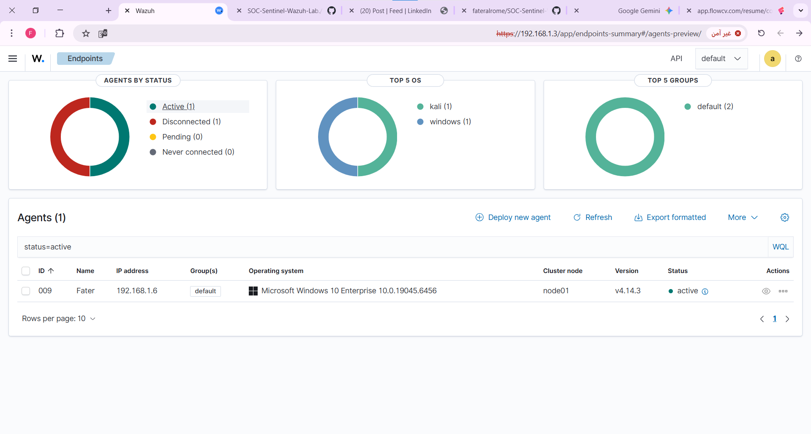
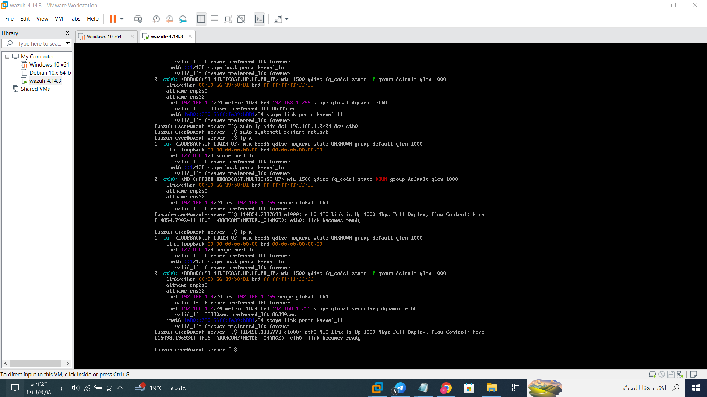
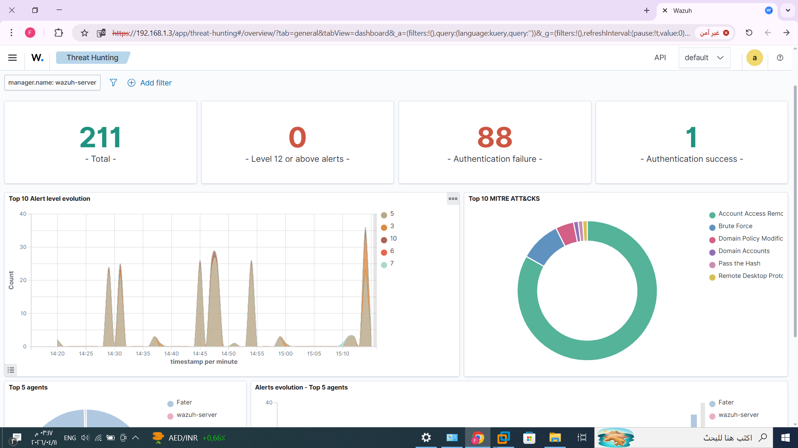

# Project Sentinel: End-to-End SOC Simulation Lab

## Overview
This project demonstrates the deployment of a professional SOC environment using Wazuh SIEM, Kali Linux, and Windows 10. It showcases the complete lifecycle of a cyberattack—from execution to detection and mapping.

## Tech Stack & Tools
* SIEM: Wazuh (Manager & Indexer)
* Attacker OS: Kali Linux (Nmap, Hydra, Metasploit)
* Target OS: Windows 10 (Sysmon installed)
* Framework: MITRE ATT&CK

## Key Activities
1. Adversary Emulation: Conducted Brute-force and Port Scanning attacks using Kali Linux.
2. Detection Engineering: Configured Sysmon and Wazuh agents to capture and alert on malicious activities.
3. Log Analysis: Correlated Windows Event Logs with Wazuh alerts for real-time monitoring.
4. Mapping: All detections are mapped to the MITRE ATT&CK framework.

## Lab Topology
## 🛡️ Lab Evidence & Monitoring
Below are screenshots from the Wazuh dashboard proving the success of the simulation and alert detection.

### 1. Active Endpoints
Confirming that the Windows 10 agent (Fater) is active and being monitored.

### 2. Wazuh Server Configuration
A look at the SIEM server terminal and network interface status.

### 3. Real-time Alert Detection
This view shows the spike in 'Authentication failures' during the simulated Brute-force attack.

## Documentation
The full technical deep-dive is available in the [PDF file](./Fater_SOC_Lab_Report.pdf).
